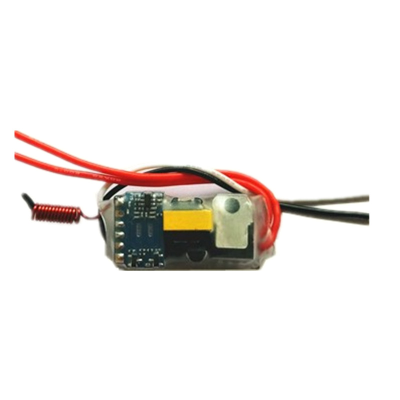
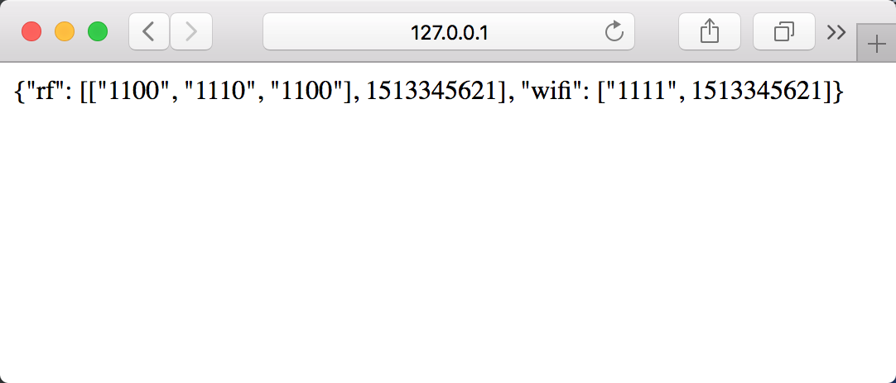

# Nodemcu、无线射频和Wifi实现家庭灯光控制
之前参与智能音箱的项目，做语义理解，但硬件方面，实在是小白，这段时间腾出些时间，折腾下硬件，把家中的灯光整体改造一下。这篇文章从设计、硬件、软件、云服务、手机应用5个方面记录了这次改造中所获取的信息以及相关的程序代码。最终构建了一个通过手机控制和传统控制兼容的智能灯光。

<a href="images/screen.jpg" target="_blank"></a>

## 系统设计
### 房屋状况
* **单火线**, 覆盖屋内大部分的开关，是开放商交付时的布线方式。
* **零火线**，两组射灯和电视墙灯带(有两组顶灯的单火开关和射灯开关放在一起)。

### 有线和无线
智能家居分有线和无线两类，有线稳定，但需装修前布线，工程量大；无线稳定稍差，但灵活便于安装。DIY的话，无线方案的资源多，结合自家房屋状况，无线的方案是首选。

### Wi-Fi、射频、ZigBee和其他
无线控制技术，以Wi-Fi、[射频](https://baike.baidu.com/item/射频)、[ZigBee](https://baike.baidu.com/item/zigbee)、[Z-Wave](https://baike.baidu.com/item/z-wave/1648507)为主，它们各有优劣，可从功耗、效率、安全、集控、分控等多方面对比，这里主要说说Wi-Fi和射频两个方案。
- Wi-Fi控制，是给开关添加Wi-Fi开关模块，让开关联网从云端获取指令，操作继电器控制开关的方案。任意一个设备都是单独产品。目前能看到大量的智能产品，里面都有类似的模块。

- [射频](https://baike.baidu.com/item/射频)，是通过无线射频传递指令，通过给开关添加射频接收模块，接收来自发射模块的指令，来控制开关的方案，类似车子遥控。射频信号以[433MHz](https://baike.baidu.com/item/RF433/10800024)和315MHz为主，产品成熟，接收端一般是学习型模块，发射端也采用通用的芯片模块。若要实现手机控制，需添加一个主机。

### 单火线电路和零火线电路

产品按电路可分**零火线开关**和**单火线开关**两种，前者稳定，后者目前还存在技术问题。智能模块本身也是用电器，需要保持运行来获取控制信号，目前**单火线开关**的技术是维持小电流让模块运行，却又达不到让电灯发光的功率，但如果电灯功率低于理论值3W，就会出现灯光闪烁的问题。目前了解到市面上已有单火电源模块：**PI-3v3-B4**。

### 云服务
我国网络运营商都不提供独立IP地址，IOT设备从云服务器获取控制指令是当前的主流方式。云服务的载体，可以是任意一台云服务器，也可以选择IOT的云服务平台。我是在自有服务器上搭建云服务。云服务的技术，采用[RESTful](https://baike.baidu.com/item/RESTful/4406165)和一个静态网页。操作流程为手机应用发送控制指令到云服务，云服务后台处理并更新静态网页，智能模块以轮询的方式获取控制指令，并控制电灯开关。

### 手机应用
IOS下的应用，使用Xcode，做个能实现[HTTP POST](https://en.wikipedia.org/wiki/POST_(HTTP))的简单程序就好。

### 最终系统方案
因为**单火线**的限制和**单火线开关**闪烁的问题，最终方案是Wi-Fi和射频联合使用的方案，并且实现手机控制。把目标分解一下就成了采购相关物料，来完成下面几个任务：
1. 制作“可联网射频发射主机”
2. 制作”Wi-Fi开关“
3. 制作“射频开关“
3. 建立“云服务”
5. 制作手机应用

## 物料
### NodeMCU开发版
网上查了查资料是性价很高的板子，购买价格不到20元，基于ESP8266-12E Wi-Fi芯片。有详尽的资料[NodeMCU Documentation](https://nodemcu.readthedocs.io/en/master/)，友好的自定义固件生成服务[NodeMCU-Build](https://nodemcu-build.com)，固件烧入程序[NodeMCU PyFlasher](https://github.com/marcelstoer/nodemcu-pyflasher)，开发工具[ESPlorer](https://github.com/4refr0nt/ESPlorer), 支持编程语言[eLua](http://www.eluaproject.net)和[MicroPython](https://micropython.org)，板上的10个GPIO接口，基本满足任何开发的需求，最后，USB供电兼调试接口，让我这个初学者也十分容易上手。

<a href="images/NODEMCU-ESP8266-LUA-CP2102-WIFI.jpg" target="_blank"></a>

### 单火线开关模块
在找射频产品的时候看到这个产品，直接解决单火线的问题，价格30元不到，接线简单，可以接收并学习常用的射频指令，如PT2262，这个模块还有一个优点是有三种模式：
1. 开/关，关闭状态下按一下开，打开状态下再按一下关。
2. 总开，开关总是打开，如果原来是打开状态，保持状态不变
3. 总关，开关总是关闭，如果原来是关闭状态，保持状态不变

可以实现灯光开关单控制，也可是实现模式控制，如“观影模式”、“会客模式”。另外，每个模式可以接收4个指令，也就是说，一盏灯可以通过最多12个指令实现不同的控制。这种设置也给我制作“Wi-Fi开关模块”缕清了思路。

<a href="images/rf-switch.jpg" target="_blank"></a>
<a href="images/rf-switch-connect.png" target="_blank"></a>

### 射频发射模块
对射频发射器我并不熟悉，只是根据PT2262的协议和433MHz随意选择了一个，担心信号不稳定，所以看着这个天线这么长，而且宣传资料说能到几千米（我家不是体育馆^^)，就买了这个。

<a href="images/rf-emitter-receiver.png" target="_blank"></a>

### 四路继电器
对继电器，和发射模块一样都属于硬件范畴，我并不熟悉，由于看过NodeMCU的资料，它能提供给继电器的最大电压是3.3V，所以就根据这个以及需要连接的继电器选择了这个4路的3.3V的继电器，产品宣传还提到了“带光耦隔离”，貌似在工作上比不带的更加稳定。

<a href="#" target="_blank"></a>

### AC-DC降压模块-220v转5v，AC-DC降压模块-220v转3.3v
NodeMCU的连接USB的工作电压是5V，但是我好想一份资料里面看到过工作点在3.3v到12v之间。因为我在这次改造中用了两个NodeMCU，其中一个连接继电器埋到了开关里面，所以需要用到这个小模块，不然太占空间。但是已经埋进去了，废了很大的劲，忘记里面用的是5v的还是3.3v的降压模块，下次再拆出来看看。另外一个NodeMCU直接USB连接。

### 其他
* **杜邦线**若干
* **云服务器**一台，直接用了自己目前使用的服务器。
* **智能手机**一台，废话了。

## 硬件部分

### 可联网射频发射主机
这个设备用到两个模块**NodeMCU开发板**以及**射频发射模块**，连接实物图如下，分别将NodeMCU的接口和射频模块上连接：

| NodeMCU | 射频模块 | 说明                              |
| ------- | -------- | --------------------------------- |
| D1      | D0       | 数据接口                          |
| D2      | D1       | 数据接口                          |
| D3      | D2       | 数据接口                          |
| D4      | D3       | 数据接口                          |
| 3V3     | +9V      | 正极, 3V3也能够使这个射频模块工作 |
| GND     | GND      | 负极                              |

<a href="images/rf_sender.jpg" target="_blank"></a>

### Wi-Fi开关 
这个模块已经埋如入墙内，翻出来太麻烦，这里拿一个三路继电器做演示，四路连接的方法是一样的，不复杂。NodeMCU接口要按照下面表格，不然得在后面的代码部分做修改。

| NodeMCU | 射频模块 | 说明     |
| ------- | -------- | -------- |
| D5      | CH1      | 数据接口 |
| D6      | CH2      | 数据接口 |
| D7      | CH3      | 数据接口 |
| D8      | CH4      | 数据接口 |
| 3V3     | VCC      | 正极     |
| GND     | GND      | 负极     |

<a href="images/relay-connect.jpg" target="_blank"></a>

### 射频开关
采购物料的时候，直接购买了单火线开关模块，这里直接跳过。

## 软件部分
该部分以代码为主，开发板烧入，云服务器的租用，手机应用开发环境的搭建皆不在本文内容中。

### 固件制作
<a href="images/nodemcubuild.png" target="_blank"></a>

进入[NodeMCU-Build](https://nodemcu-build.com),输入邮箱地址，再选择下面的模块，在最下方点击**Start your build**，不用多久邮箱就会说到两封邮件，一封是说正在制作请稍后，另一封就制作好的，下载即可烧入。

固件模块：
cron,crypto,dht,encoder,enduser_setup,file,gpio,http,mqtt,net,node,sjson,tmr,uart,wifi

### 控制码规格
射频发射模块有四个数据接口，每次给接口一个高电平，就发射一次信号，而且不同的高电平组合所发射信号不同，所以一共可以组成16组不同的数据信号，这类似于二进制的信号结构，见表格：
| 指令   | 二进制 | 十进制 | 备注          |
| ------ | ------ | ------ | ------------- |
| 指令0  | 0000   | 0      | 该指令不工作 |
| 指令1  | 0001   | 1      |               |
| 指令2  | 0010   | 2      |               |
| 指令3  | 0011   | 3      |               |
| 指令4  | 0100   | 4      |               |
| 指令5  | 0101   | 5      |               |
| 指令6  | 0110   | 6      |               |
| 指令7  | 0111   | 7      |               |
| 指令8  | 1000   | 8      |               |
| 指令9  | 1001   | 9      |               |
| 指令10 | 1010   | 10     |               |
| 指令11 | 1011   | 11     |               |
| 指令12 | 1100   | 12     |               |
| 指令13 | 1101   | 13     |               |
| 指令14 | 1110   | 14     |               |
| 指令15 | 1111   | 15     |               |

Wi-Fi开关也不复杂，根据四路继电器控制四路灯光，设置4位的信号，每一位对一路继电器即可。

|              | 开  | 关  |
| ------------ | --- | --- |
| 第一路继电器 | 1   | 0   |
| 第二路继电器 | 1   | 0   |
| 第三路继电器 | 1   | 0   |
| 第四路继电器 | 1   | 0   |

开发版和云服务交互获的指令格式，JSON格式，"rf"表示射频指令，"wifi"表示Wi-Fi指令，4位的数字表示控制信号，而另一个数字，如下面的“1513249981”，表示指令发送的时间戳。

```JSON
{
    "rf": [["0100","0011"], 1513249981], 
    "wifi": ["0000", 1513278152]
}
```

### 射频主机和Wi-Fi开关的代码 
**注意**，中文的注释在程序写入后会引起错误，所以下面代码需要去处中文注释才能正常使用

#### init.lua
系统初始化文件，每次NodeMCU重启后，会执行该文件该文件一共包含了两个模块:
```Lua
-- init.lua
connect = require("connect")
connect.start()
light = require("light")
light.start()
```

#### connect.lua
Wi-Fi连接模块，固件中的end_user, 用户可以通过连接开启的热点网络输入个人Wi-Fi的账号密码，使设备连网。
```Lua
-- file: connect.lua
local module = {}
function module.start()  
enduser_setup.start(
    function() -- 连接成功打印当前IP地址
        print("Connected to wifi as: " .. wifi.sta.getip())
    end,
    function(err, str) -- 连接不成功打印错误信息
        print("enduser_setup: Err #" .. err .. ": " .. str)
    end
);
end
return module  
```

#### light.lua
灯光的总控模块，代码集合了射频和Wi-Fi控制，在我的工程中，两个NodeMCU分别使用了其中的一种控制方式。按本文的介绍，需要将变量"url"里面的"服务器地址"修改为对应的内容。
```Lua
-- file: light.lua
local module = {}
function module.start()  

-- 设置接口，按照硬件部分的连接方式
--[[
D0 = 1
D1 = 2
D2 = 3
D3 = 4
CH_1 = 5
CH_2 = 6
CH_3 = 7
CH_4 = 8
]]
gpio_map = {1,2,3,4,5,6,7,8}
gpio_map_rf = {1,2,3,4}
gpio_map_wifi = {5,6,7,8}

-- 初始化GPIO接口的模式为OUTPUT，即将信号输出到信号模块
for idx=1, #gpio_map do
    pin = gpio_map[idx]
    gpio.mode(pin, gpio.OUTPUT)
end

-- 初始化最后一次接收控制指令的时间，区分指令是否是新指令
last_wifi_time = 0
last_rf_time = 0
-- 访问地址，这里是我家用设备的访问地址，我设置了一个静态网址
url = 'http://服务器地址/smartlife/static/light.html'

-- 轮询，每1秒访问一次网页获取最新的信息
-- 这里使用tmr.alarm，而不是设置while...tmr.delay，是因为while...tmr.delay会卡住所有的进程，tmr.alarm类似于建立一个线程，不会卡住其他进程。 
tmr.alarm(0, 1000, 1, function ()
    -- 通过HTTP GET的方式获取网页数据
    http.get(url, nil, function(code, data)
        if (code < 0) then
          print("HTTP request failed")
        else
            -- 数据格式为：{"rf": ["0100", 1513249981], "wifi": ["0000", 1513278152]}
            -- sjson是固件中的sjson模块
            dt = sjson.decode(data)
            for k, v in pairs(dt) do 
                -- k是'rf', v是["0100", 1513249981]
                if k == "rf" then
                    part_data = v[1]
                    -- 将字符格式的时间戳转成整数
                    part_time = tonumber(v[2])

                    --获取的时间和最后一次的时间做对比
                    if last_rf_time == 0 then
                        last_rf_time = part_time
                    else
                        if part_time > last_rf_time then
                            for mode_idx=1, #part_data do
                                mode = part_data[mode_idx]
                                for idx=1,4 do
                                    v = string.sub(mode, idx,idx)
                                    gpio.write(gpio_map_rf[idx], tonumber(v))
                                end
                                tmr.delay(300000)
                                for idx=1,4 do
                                    gpio.write(gpio_map_rf[idx], 0)
                                end
                                tmr.delay(300000)
                            end
                            last_rf_time = part_time
                        end
                    end
                elseif k == "wifi" then
                    part_data = v[1]
                    part_time = tonumber(v[2])
                    if last_wifi_time == 0 then
                        last_wifi_time = part_time
                    else
                        if part_time > last_wifi_time then
                            for idx=1,4 do
                                v = string.sub(part_data, idx,idx)
                                gpio.write(gpio_map_wifi[idx], tonumber(v))
                            end
                            last_wifi_time = part_time
                        end
                    end
                end
            end             
        end
    end)
end)
end
return module  
```

## 云服务
云服务器系统使用: [Ubuntu](https://www.ubuntu.com)

云网页服务框架用采用Python服务器框架: [Flask](http://flask.pocoo.org)

Python版本: >= Python 3.4

安装Python依赖库
```bash
pip install requirements.txt
```

进入server目录后，执行下面的指令启动Flask服务器
```bash
python run.py
```
<a href="images/flask_server.png" target="_blank"></a>

打开网页输入地址
```bash
   http://127.0.0.1:5000/smartlife/static/light.html
```
<a href="images/light-page.png" target="_blank"></a>

在另外一个终端执行下面代码，能获取返回信息：
```bash
python sample.py
#{"text":u"LightControl"}
```
服务器的那个终端会出现访问记录

<a href="images/request_post.png" target="_blank"></a>
<a href="images/after_req-page.png" target="_blank"></a>

如果硬件已经设置，这时候就有效果了。

Flask相关的代码就不细说，这里主要说一下在server/app/smartlife/actions.py里面的代码。

代码的第一部分定义射频和Wi-Fi两个模块的控制指令，并组建控制模式。这里如此设置是简化了手机应用开发的过程，当然这样的设置，只适合个人使用。

```Python

# 射频模块2进制形式的数据格式，通过strint2bin将整数的字符串转成二进制的字符串 1 -> 0001
strint2bin = lambda i: "%04d"%int(bin(int(i, 10)).replace("0b", ""))
rf_buttons = {"厨房灯": strint2bin("1"),
              "书房灯": strint2bin("2"),
              "电视墙灯": strint2bin("4"),
              "厨房灯开": strint2bin("9"),
              "书房灯开": strint2bin("10"),
              "书房灯关": strint2bin("11"),
              "电视墙灯开": strint2bin("12"),
              "厨房灯关": strint2bin("13"),
              "电视墙灯关": strint2bin("14"),
              "全关": strint2bin("15")}

# WiFi的开关理论上只有两种形式，开（1）或关（0），这里增加None，类似于传统开关，按一下就开或者关。
wifi_buttons = {"餐厅灯开关": (0, None),
                "餐厅灯开": (0, "1"),
                "餐厅灯关": (0, "0"),
                "餐厅射灯开关": (1, None),
                "餐厅射灯开": (1, "1"),
                "餐厅射灯关": (1, "0"),
                "客厅灯开关": (2, None),
                "客厅灯开": (2, "1"),
                "客厅灯关": (2, "0"),
                "客厅射灯开关": (3, None),
                "客厅射灯开": (3, "1"),
                "客厅射灯关": (3, "0")}


# 定义了各种类型的模式控制，已达到室内灯光的总控。
modes = {"餐厅模式": [["餐厅灯开", "餐厅射灯开", "客厅灯关", "客厅射灯关"],
                  ["电视墙灯关"]],
         "客厅模式": [["餐厅灯关", "餐厅射灯关", "客厅灯开", "客厅射灯开"],
                  ["电视墙灯开", "电视墙灯关","电视墙灯开"]],
         "会客模式": [["餐厅灯开", "餐厅射灯开", "客厅灯开", "客厅射灯开"],
                  ["电视墙灯开", "电视墙灯关","电视墙灯开"]],
         "普通模式": [["餐厅灯开", "餐厅射灯关", "客厅灯开", "客厅射灯关"],
                  ["电视墙灯关"]],
         "观影模式": [["餐厅灯关", "餐厅射灯关", "客厅灯关", "客厅射灯关"],
                  ["电视墙灯开", "电视墙灯关","电视墙灯开"]],
         "餐厅灯": [["餐厅灯开关"], None],
         "餐厅射灯": [["餐厅射灯开关"], None],
         "客厅灯": [["客厅灯开关"], None],
         "客厅射灯": [["客厅射灯开关"], None],
         "电视墙灯": [None, ["电视墙灯"]],
         "书房灯": [None, ["书房灯"]],
         "厨房灯": [None, ["次卧灯"]],
         "全关": [["餐厅灯关", "餐厅射灯关", "客厅灯关", "客厅射灯关"], ["全关"]]}
```

代码的第二部分是实现数据的处理，更新静态文件配合同目录下的view.py使用，这段代码简化的安全验证，其他人也可以在知道地址的情况下提交数据。
```Python
class Action(object):

    def __init__(self):
        here = path.abspath(path.dirname(__file__))
        self.filepath = path.join(here, "static", "light.html")

        # 初始化静态页面
        if not path.exists(self.filepath):
            f = open(self.filepath, "w")
            f.write(json.dumps({"rf":[["0000"], 0], "wifi":["0000", 0]}))
            f.close()

    def do(self, mode):
        """
        Return:
        {"rf": [["1100", "1110", "1100"], 1513345236], "wifi": ["1111", 1513345236]}
        """
        reponse = None
        time_now = int(time.time())
        with open(self.filepath, 'r') as inf:
            status = json.load(inf)
        if mode in modes:
            wifi, rf = modes[mode]
            if wifi is not None:
                status_list = [s for s in status['wifi'][0]]
                for btn_name in wifi:
                    btn, value = wifi_buttons[btn_name]
                    status_value = status['wifi'][0][btn]
                    if value is None:
                        status_list[btn] = "0" if status_value == "1" else "0"
                    else:
                        status_list[btn] = value
                status['wifi'][0] = ''.join(status_list)
                status['wifi'][1] = time_now

            if rf is not None:
                for btn_name in rf:
                    btn = rf_buttons[btn_name]
                    status['rf'][0] = btn
                    status['rf'][1] = time_now
                    if len(rf) > 1:
                        time.sleep(1.5)
                        with open(self.filepath, 'w') as outf:
                            outf.write(json.dumps(status))

            reponse = """{"text":u"LightControl"}"""
            with open(self.filepath, 'w') as outf:
                outf.write(json.dumps(status))
        return reponse if reponse is not None else ""


if __name__ == "__main__":
    f = Action()
    f.do("全关")
```
## 手机应用

新建项目后，在Main.storyboard添加多个按钮，如下图，每个按钮设置名称和云服务里actions.py的modes里面内容相同。

<a href="images/app.png" target="_blank"></a>

在对应的ViewController.swift里添加下面代码,并将Main.storyboard里面的按钮和doAction()连接。之后编译发送到手机就可以用了。
```Swift

import UIKit

class ViewController: UIViewController {

    override func viewDidLoad() {
        super.viewDidLoad()
    }

    override func didReceiveMemoryWarning() {
        super.didReceiveMemoryWarning()
    }
    
    func sendCMD(cmd: String) {
        let myUrl = URL(string: "http://服务器地址/smartlife/");
        var request = URLRequest(url:myUrl!)
        request.httpMethod = "POST"// Compose a query string
        let postString = "msg="+cmd;
        request.httpBody = postString.data(using: String.Encoding.utf8);
        let task = URLSession.shared.dataTask(with: request) { (data: Data?, response: URLResponse?, error: Error?) in
        }
        task.resume()
    }
    
    @IBAction func doAction(_ sender: UIButton) {
        sendCMD(cmd: sender.currentTitle!)
    }
}
```
## 总结
至此，整个项目从系统设计，物料采购，硬件连接，数据结构，软件代码到手机应用制作，最后把硬件埋入开关就完成了。实施的过程，也遇到不少问题，比如单火线开关的频闪问题，NodeMCU的GPIO接口有些会一直发送高电平，Wi-Fi开关模块做的太大了，放不进盒子等许多问题。这个系统，还存在安全问题，比如射频开关是接收较通用的固定码指令，这会出现撞码的可能。信号反馈的问题，要满足传统开关的使用需求，改的开关保留了原来的面板，射频和Wi-Fi模块都无法获取面板的物理开关信号，以便及时更新数据到云端。代码的模块化没做到最好，现在只适合个人使用。这些问题在以后有空的时候，慢慢修改。
